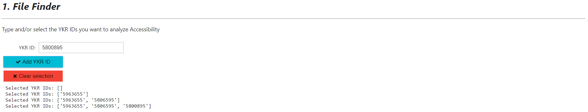
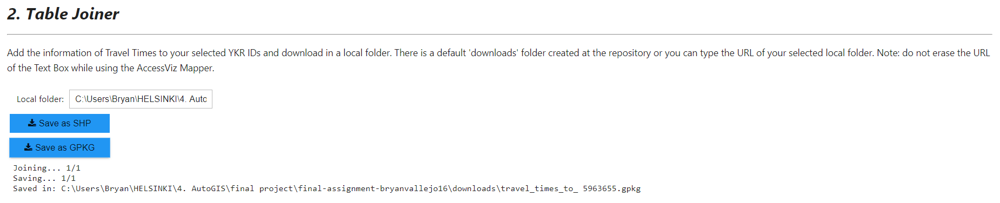
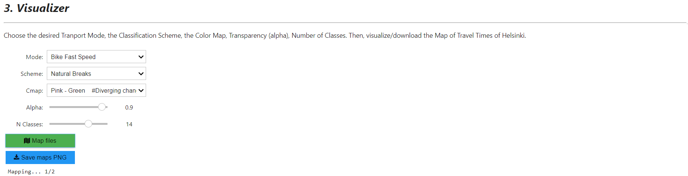
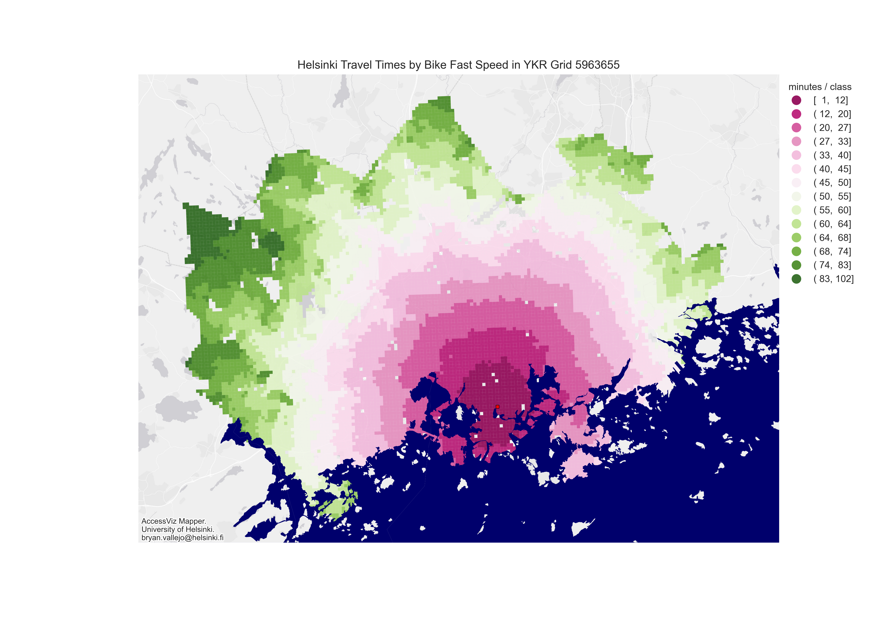
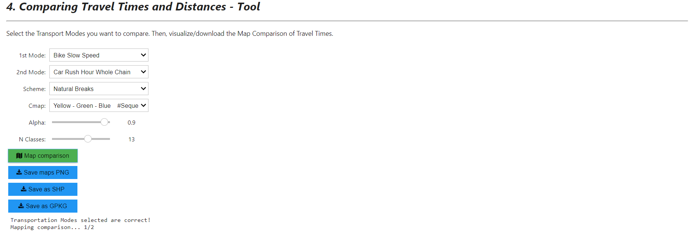
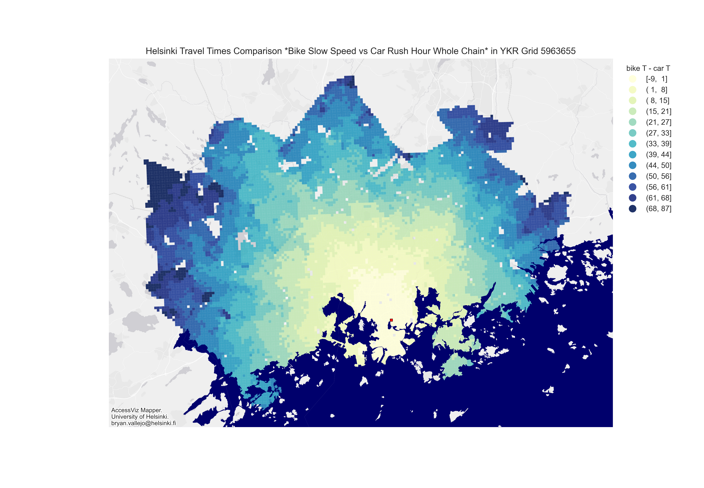
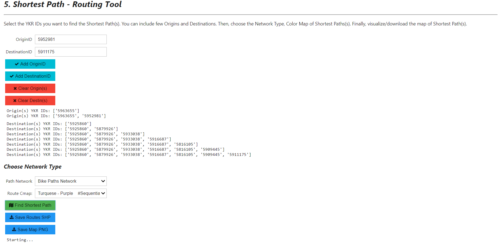
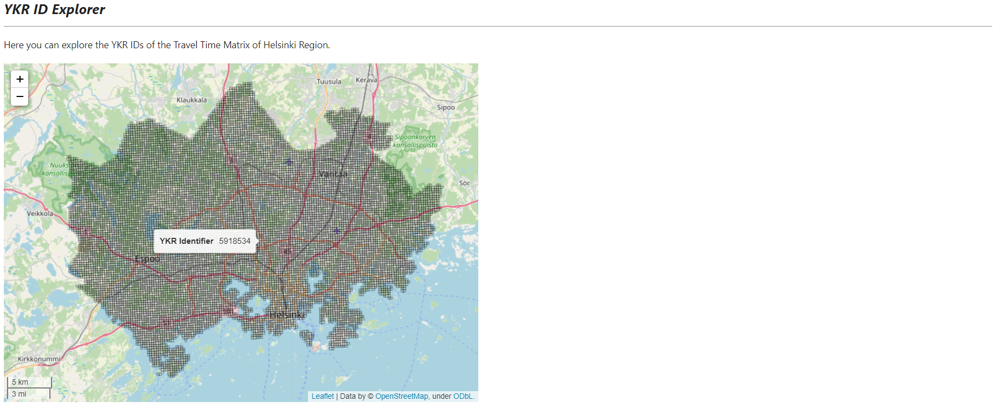

## AccessViz Mapper

## Topic: 
**AccessViz Mapper** - A handy tool for mapping Accessibility Travel Times by different Transport Modes at Helsinki Region

### Description:
**AccessViz Mapper** is a tool which can be deployed as a web app/desktop app. In this repository, the code can be found in a notebook which is rendered using Voila. Follow the instructions to make it work at your local disk by downloading the Repository. 

### Guided tutorial:
[How to make Travel-Time (accessibility) maps with accessviz-mapper](https://towardsdatascience.com/travel-time-accessibility-maps-with-the-accessviz-mapper-tool-in-helsinki-7be23eadd4b0)

### Packages needed
- voila `conda install -c conda-forge voila`
- ipywidgets `conda install -c anaconda ipywidgets`
- folium
- pyproj
- geopandas
- matplotlib
- glob 
- os 
- numpy
- contextily
- mapclassify
- osmnx `conda install -c conda-forge osmnx`
- networkx
- shapely

### Structure of this repository:
 - `Data` <folder> In this you can find the base data to create map visualization. It contains sample data of YKR IDs with Travel Times so you can test the App without including all the data.
  
- `accessviz-mapper.ipynb` <Jupyter notebook> Notebook which is deployed in Voila and includes all the code.

### Default data:
Default data contains Travel Times data with code: `5816xxx`, `5879xxx`, `5916xxx`, `5925xxx`, `5933xxx`, `5952xxx`, `5963xxx`.
As a recommendation, use the sample data already in the repository. As an example, some existent YKR IDs are: `5963655`, `5933038`, `5816105`.

### Input data and note to download:
- The whole data can be downloaded from here [Travel Time Matrix of Helsinki Region 2018](https://blogs.helsinki.fi/accessibility/helsinki-region-travel-time-matrix-2018/)

**NOTE**: After downloading the Repository in the Local Disk, unzip the data and include all the folders i.e. ***5963xxx*** in the `data/HelsinkiTravelTimeMatrix2018` folder.

### Deploy instructions with Voila
- Download/clone the repository in Local Disk
- Open Anaconda command prompt
- Be sure that you are using the `environment` where Voila is installed
- Be sure that you are at the repository `cd repository`
- Type `voila accessviz-mapper.ipynb`

This line will start a localhost with the Desktop App/Dashboard.

### Results:

### References:
- [Helsinki Region Travel Time Matrix Blog](https://blogs.helsinki.fi/accessibility/helsinki-region-travel-time-matrix/)
- [Voila Documentation](https://voila.readthedocs.io/en/stable/index.html)
- [Ipywidgets Documentation](https://ipywidgets.readthedocs.io/en/stable/index.html)
